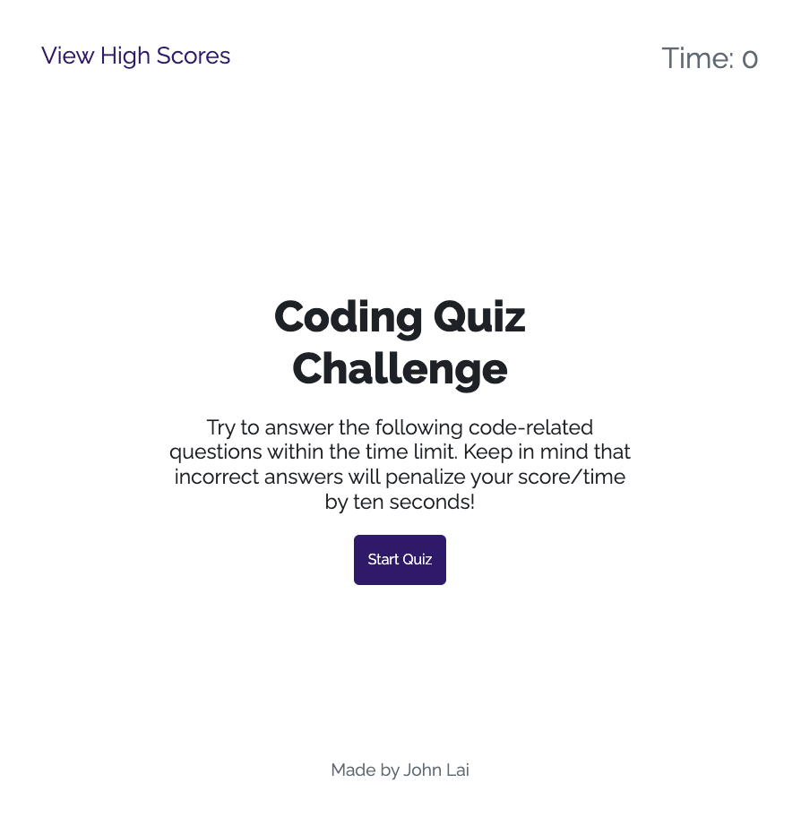

# Javascript Code Quiz
# User Story
* As a coding boot camp student I want to take a timed quiz on JavaScript fundamentals that stores high scores
so that I can gauge my progess compared to my peers

# Description
* This is a Javascript Coding Quiz Challage Game!  It web API's localStorage object to store players infomation at the end of the game. You can always see who has the highest score by clicking on the high score button.
Enjoy!

* This project uses bootstrap v5.3 and Google Font
* Enjoy!

# Screenshot

# Live Site
* https://johnxlai.github.io/javascript-code-quiz/
